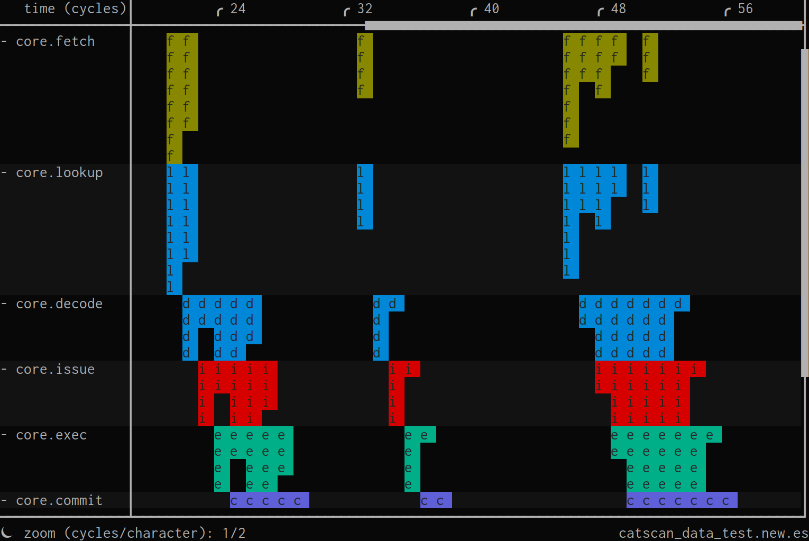

# catscan

`catscan` is a terminal UI for browsing performance event streams.



This repository builds and installs:

- `catscan` Python package

## Prerequisites

Install build tools:

* `python3` (3.12+ recommended)
* `hatch`

### Runtime Dependencies

These are python dependencies which may or may not be installed for you
depending on how you install or build catscan. For example, you may need to
ensure they are installed first if you are using OS-provided python packages
instead of a virtual environment/`pip`:

- [`perf-streams`](https://github.com/AmpereComputing/hpca2027_industry92_perf-streams) (catscan's sister project - provides event stream definitions
  and libraries/utilities)
* `capstone` (5.0+)
* `protobuf` (4.25.0+)
* `urwid` (2.6.16+)

## Build

From repository root:

```bash
python3 -m venv .venv
source .venv/bin/activate
pip install .
deactivate
```

What this does:

* Create a virtual environment `.venv`
* Enter environment
* Installs/builds `catscan` and `events` (and their dependencies) into virtual
  environment
* Exit environment

## Run catscan

```bash
./venv/bin/catscan --help
```

## User Guide

### Configuration

#### Mapping files

When abbreviations are too dynamic for the built-in `--static-abbrev`,
`--value-string-abbrev`, or `--value-map-abbrev` options you can use
`--mapping-file` to provide a python file for adding arbitrary abbreviations.
Primarily these are for `catscan.events.mapping.DynamicAbbreviation`. Within
your python file, you can use the built-in `add_abbreviation(...)` to add a new
abbreviation. For example:

```python
from catscan.events.mapping import CallableAbbreviation

def abbreviate(self, event):
    return "h" if event.data["hit"] else "m"

add_abbreviation(CallableAbbreviation(["lookup"], generate=abbreviate))
```

### Types of views

Multiple "views" of events are supported; however, you can only start `catscan`
with one.

#### Resource view

Resource view has time-ordered rows of events organized by event type.

#### Transaction view

Transaction view has rows which represent a transaction (e.g. uop, instruction,
etc.) with time-ordered events that appear on that transaction (or child) within
the row. Unlike resource-view these are potentially different types of events in
the same row. Each row also has a highlighted region with denotes its start/end
(depending on the events provided).

### Basic navigation

Once you have loaded an event-stream, you'll want to be able to navigate and
explore. Basic exploration can be accomplished either by keyboard or by mouse,
detailed below. Typing `:help` at any point will display the current key/mouse
mappings and brief summaries of available commands. You can also do
`:help <command>` to get just the help for a specific command.

Note that `catscan` accepts two main type of keyboard interaction: 'commands' and
'key bindings/sequences'. Commands are entered much the same way they are in
vim: typing `:` (a literal colon) causes a command prompt to appear at the
bottom of the screen, into which you then type a command (or use ESC to
cancel). If a keybinding is prefaced by a colon in this documentation, it can
be assumed to be a command. Key sequences without colons are regular
keybindings which are typed into the interface directly (and for which you will
not receive visual feedback of what you are typing).

#### By keyboard

Keyboard navigation is intentionally similar to `vim` (sorry, Emacs users!).
Here are the primary navigation key mappings:

Key sequences/commands | Description
---------------------- | -----------
`h`/`j`/`k`/`l` or arrow keys | move left/down/up/right
`+`/`-`                 | zoom in/out
`gg`/`G`                | go to first/last event row
`?`                     | display help output (alias of `:help`)
`ZZ`                    | exit catscan
`ESCAPE`                | close popup, sidebar, or in-progress command/search
`CTRL-b`/`CTRL-f`       | full page up/down
`CTRL-u`/`CTRL-d`       | half page up/down
`e`/`E`                 | toggle expanded/condensed mode
`0`                     | go to beginning of selected row
`$`                     | go to end of selected row
`==`                    | zoom so that selected row fits in window
`:zoom fit`             | zoom so that selected row fits in window
`:zoom extents`         | zoom so everything fits in the window
`:zoom`                 | zoom to specified cycles/character level

You may also go directly to a particular row of events by typing `:<event
glob>`, where "\<event glob\>" is any
[glob](https://en.wikipedia.org/wiki/Glob_(programming) ) matching one or more
rows of events. For example, `:*some_event_name` would take you to the first row
matching that glob after the currently-selected row (wrapping around if none is
found before the bottom of the screen).

##### Expanded/condensed event rows

When you first load an event stream with `catscan`, it displays as much of the
event stream as possible at once. The view will be zoomed out in time and show
all rows of events in their 'condensed' mode. The condensed view means each row
of events is represented by only a single row of characters even if that event
row has more than one event in a given cycle. In contrast, the expanded view
uses one row of characters for each row of events so it can show a textual
summary/abbreviation of each individual event if you are sufficiently zoomed
in. 'Condensed' and 'expanded' views can be toggled between by pressing the
`e`/`E` keys.

#### By mouse

The main view can also be navigated by mouse. It can be panned, zoomed,
scrolled, and translated:

Mouse interaction        | Description
------------------------ | -----------
left click + drag        | pan all event rows up/down/right/left
wheel up/down            | zoom in/out (time-wise)
`CTRL` + wheel up/down   | scroll up/down through event rows
`SHIFT` + wheel up/down  | translate event rows right/left
double left click        | jump to next event in empty row
`CTRL` double left click | jump to previous event in empty row

### Exiting

Like
[vim](https://stackoverflow.com/questions/11828270/how-do-i-exit-vim#11828573),
you exit catscan by typing `ZZ`, or by entering the `:q` or `:quit` commands followed by the ENTER key!

### Selecting events

`catscan` allows selecting either single events or event regions with a left
mouse-click. Detailed information for each selection is then displayed via a
right-hand sidebar. If you are zoomed out or in 'condensed' mode such that one
terminal column represents more than one event, clicking on that character
selects all events represented by it; otherwise, a single event is selected.

You may extend an existing selection to include more events in the same row
by `SHIFT + left click`-ing on a point on the screen representing one or more
events outside the existing selection.

When an event or event region is selected, you may de-select it either by
pressing `ESCAPE` or clicking the '< Close >' button in the right-hand sidebar.

Keyboard/mouse interaction | Description
-------------------------- | -----------
left click                 | make new selection
`SHIFT` + left click       | expand existing selection until it includes the clicked region
`ESCAPE`                   | clear selection

### Summarizing events

You may wish to view a 'summary' of a row of events (or a subset thereof). In
this context, a summary is a histogram of the 'abbreviations' (the single piece
of text displayed for each event in the main window) of all summarized events.
It allows you to, for example, get a quick idea for whether most cache accesses
were hits or misses for a given period of time, or what the mix of decoded
instructions was. If you want to get a summary for some data field instead
(e.g. the event is not abbreviated by the field you want), you can specify
`field=<field>` (similar to search) to summarize the field values.

If you select more than one event (see above), a summary of those events is
automatically displayed on the right-hand sidebar. You may also generate a
summary for an entire row with the `:summarize` command, or generate a summary
between two marks via `:summarize <mark 1> <mark 2>` (see below for more about
generating marks).

### Searching for events

You may also search for particular events. The simplest search can be
accomplished by using the `/` key or `:search` command, followed by the string
you wish to search for. As shown in the table below, you can navigate between
matches (if there are multiple) as well as clear the active search:

Key sequences/commands | Description
---------------------- | -----------
`/`                    | begin entering search terms
`:search`              | begin entering search terms (command version)
`ENTER`                | trigger search for entered search terms and go to first result
`n`                    | go to next match
`N`                    | go to previous match
`:clear search`        | clear the current search (stops highlighting it in green)
`:zoom search`         | zoom to fit all search matches

You can refine searches beyond simple text searches by adding one or more
'search specifier'. To use a search specifier, type it in after your search
term(s) and before hitting the ENTER key to trigger the search. Except as noted
in the table below, search specifiers may be combined. Here are the available
specifiers:

Search specifier               | Description
------------------------------ | -----------
`rows=(\<row glob\> \| current)` | only match events in row(s) matching a glob or the currently-selected row with "current"
`fields=\<field glob\>`          | only search event field(s) matching a glob
`mask=\<bitmask\>`               | only require matching bits in integer fields which are set in the mask (integer search terms only), `~` can be used to invert the mask
`match_case=(yes \| no)`         | whether to require case matching (string search terms only)
`type=(auto \| int \| string)`   | which type of comparison/matching to use when comparing to the search term

> **Note:** each supplied search specifier/value pair should be separated from search
> term(s) and other specifiers by a space, but there should not be spaces between
> the specifier, the equals sign, and the specifier value. For example, the
> following would match any events within the currently-focused event row with
> fields with names matching *.br_type which contained any upper-/lower-case
> variation of 'CONDITIONAL_DIRECT':

```
:search CONDITIONAL_DIRECT rows=current fields=*.br_type match_case=no
```

#### Smart case sensitivity

By default, searches are case-sensitive only if the search string contains
capital letters. For example, searching for 'conditional_direct' would match
all three of ['conditional_direct', 'Conditional_Direct', and
'CONDITIONAL_DIRECT']. However, searching for 'CONDITIONAL_DIRECT' would only
match 'CONDITIONAL_DIRECT'. This behavior can be overridden by specifying
`match_case=yes` or `match_case=no` as a search specifier.

> **Note:** This is similar behavior to `:set smartcase` in vim.

#### Searching type/method

By default, `catscan` auto-detects whether the search term you supply should be
treated as an integer or a string. Specifically, it treats the supplied search
term as an integer if the python code `int(search_term, base=0)` succeeds, and
a string if it fails. When using integer-matching mode, event data items which
are in non-integer types are not even considered for matching (a search command
of `:search 3` will match an integer field '3', but not a string field '3').
String matches, on the other hand, will attempt to match on the string
conversion of integers (using the hex string if those fields are otherwise
displayed as hex). To force a string match to be used for search terms which
are possible to convert to integers, you may use `:search 3 type=string`.

### Highlighting transactions

`catscan` can highlight all events belonging to a particular transaction or group
of transactions to allow you to more quickly explore their behavior. `catscan`
supports this via both keyboard and mouse. Via keyboard, you may highlight the
events of the transaction the currently-selected event belongs to via `t`, or
that transaction **and all of its ancestors and descendants** with `T`. With
either option, all transactions/events highlighted by a single highlight action
will use the same color.

When one or more transactions are being highlighted, non-highlighted events are
grayed out so highlights stand out. `catscan` uses the least-used color from
among the color palette for each new highlight. You may remove active
highlighting either by selecting an event from an active highlight and toggling
it with `t` or `T`, or by typing `:clear highlights` to clear all highlighting.

Key sequences/commands | Description
---------------------- | -----------
`t`                    | toggle highlighting on/off for the transaction of the currently-selected event
`T`                    | toggle highlighting on/off for the transactions of the currently-selected event and all its ancestor and descendant transactions
`:clear highlights`    | clear all active transaction highlighting
`:zoom highlights`     | zoom to show all active transaction highlights

In addition to using the keyboard method, you may also highlight/un-highlight
transactions and groups of transactions from the 'event detail sidebar' which
appears to the right whenever an event is selected.

### Marking events

You can mark (i.e. bookmark) events to come back to later, or to use as input
to other commands (they can be used with the `:summarize` command above). In
`catscan`, marking an event causes it to be remembered by the single-character
name you give it until you overwrite it or exit the program. The time-row
(which displays the number of cycles into the run at the top of the
user-interface) also displays the location of any remembered marks.

Key sequences/commands | Description
---------------------- | -----------
`m\<key\>`             | create a mark named by \<key\> referring to the currently-selected event
`'\<key\>`             | go to the event marked with \<key\>
`:marks`               | list all marks
`:zoom marks`          | zoom to specified (or all) marks

### Pinning event rows

Individual rows can be pinned to a sub-view by typing `:pin` with the row
selected that you want to pin, or by supplying a glob matching the row(s) as an
argument like `:pin *commit`. Pinned rows will always be visible at the top of
the screen (unless over 16 rows) and will always be "collapsed", giving a
general idea of the amount of events in a region. You can stop rows from being
pinned with `:unpin` (to unpin the selected row), `:unpin <row glob>` (to unpin
all matching rows), or `:unpin all` (to remove all).

### Syncing two catscan instances on instruction commit

It can be useful to synchronize two event streams to simultaneously view
equivalent regions of both - for example, to debug performance divergences.
A consistent identifier is needed (for example, a committed instruction
index), to provide landmarks to synchronize against.

Using instruction commit events, `catscan` supports synchronizing the zoom level
and position in time of two `catscan` processes using UNIX pipes. To use this
feature, first load the event streams you wish to sync in two separate `catscan`
processes (note: each may use different arguments/configuration files). I find
it works well to load them as two panes in the same
[tmux](https://github.com/tmux/tmux/) window, but it is only important for them
to be running on the same machine. Then, enter the command `:sync_commits
<filename prefix>` in both processes, where \<filename prefix\> may be any path
(relative or absolute) which you have the permissions to modify/create.
\<filename prefix\> must be the same for both processes in this *pair*, but
unique from any other usages. I typically load both instances of `catscan` in the
same directory and use short relative filenames for ease of use. Once you do
this, synchronization will begin.

Key sequences/commands                 | Description
-------------------------------------- | -----------
`:sync_commits \<filename prefix\>`    | begin synchronizing the UI via commit events by communicating over UNIX pipes named using \<filename prefix\> (same filename must be supplied by both synchronized processes)
`:sync_commits stop`                   | stop synchronizing commit events with another process

> **Note:** In order to use, instruction commit event and data names must be
> specified. See `catscan --help` for details.

#### Excess commit pushout events

Upon commit synchronization initialization, two additional event rows are
inserted to help locate/debug the source of performance differences. These new
rows are inserted into the UI immediately after where the instruction commit
event appears. They are named 'excess_commit_pushout' and
'debounced_cumulative_pushout'. 'excess_commit_pushout' is present for any
cycle in which the last committed instruction for the current `catscan` process
has an earlier instruction index than the last committed instruction for the
process it is synchronized with. 'debounced_cumulative_pushout' is a
"de-bounced" version of 'excess_commit_pushout' which only counts for cycles in
which the excess commit pushout is diverging from the previous commit pushout
relative to an allowed margin of error (for example, 'excess_commit_pushout'
will count in the case where two traces are committing at an identical rate,
but for which instruction commits are broken slightly differently across
cycles; 'debounced_cumulative_pushout' will not).

### Command-mode history and tab-completion

`catscan`'s command mode has limited tab-completion. If you enter the first part
of a command, pressing TAB will finish typing the command for you. If there are
multiple ambiguous matches, you can continue pressing TAB to see more of them.
SHIFT-TAB cycles through the completions in reverse.

Key sequences                 | Description
----------------------------- | -----------
`:\<command prefix\>TAB`      | tab-complete the remainder of the command beginning with \<command prefix\>
`TAB`                         | go to the next tab-completion (if more than one)
`SHIFT-TAB`                   | go to the previous tab-completion (if more than one)

There is also a command/search history buffer which can be accessed with the
up/down arrows after entering command mode (via `:`). In addition to allowing
you to browse the full command/search history, if you enter the beginning of a
command prior to hitting the up arrow, the history entries shown will only be
those which share the already-entered prefix. As is common with command
histories, if/when you find a command in the history which you want to repeat,
you may either press ENTER immediately to use it again verbatim, or edit it
first.

Key sequences                 | Description
----------------------------- | -----------
`:UP`                         | begin viewing command history
`/UP`                         | begin viewing search history
`:\<command prefix\>UP`       | begin viewing command history matching \<command prefix\>
`UP`                          | go to the earlier history item/match
`DOWN`                        | go to the later history item/match

### Automation

`catscan` has a couple times at which you can schedule commands to be run in
advance. You can do this either via the command-line or in a config file (since
our config files are just a different way to specify command-line arguments).
`--onload-command` and `--onsync-command` allow you to set commands to be
executed when an event-stream is finished being loaded and when commit sync
(setup via the `:sync_commits` command) is fully initialized, respectively. For
example, if on startup you always wanted to begin commit sync and then pin the
`debounced_cumulative_pushout` row, you could add the two following
command-line arguments to your `catscan` invocation:

```
--onload-command "sync_commits gappr" \
--onsync-command "pin *.debounced_cumulative_pushout"
```
